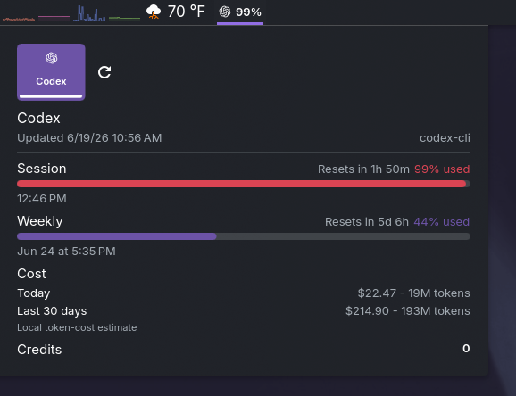

# KodexBar Plasma

> All-provider CodexBar usage in your KDE Plasma panel.

[](https://kde.org/plasma-desktop/)
[](https://github.com/steipete/CodexBar)
[](LICENSE)

KodexBar Plasma is a native KDE Plasma widget that displays all-provider usage returned by the external [CodexBar](https://github.com/steipete/CodexBar) CLI. It renders the CLI response in a compact panel view and a Plasma-native popup.

The CLI is the boundary: KodexBar Plasma runs one configured executable with `usage --provider all --format json --json-only`. CodexBar remains responsible for provider configuration, credentials, API access, and its own data acquisition.

## Provenance

KodexBar Plasma is an open-source derivative of [KodexBar](https://github.com/tylxr59/KodexBar) by `tylxr`, adapted as a KDE Plasma integration. The upstream MIT license and copyright notice are preserved in [LICENSE](LICENSE), together with attribution for this project's changes.

This project does not redistribute the external [CodexBar CLI](https://github.com/steipete/CodexBar); it invokes the user's separately installed executable.



## MVP scope

- **All-provider usage.** Shows usable CLI providers in response order with available Session, Weekly, and Monthly windows.
- **Trustworthy compact summary.** Shows the highest valid percentage without remapping CLI fields.
- **Plasma-native UI.** Uses Plasma 6 and Kirigami controls with a compact panel item and one scrollable popup.

## Requirements

- KDE Plasma 6
- `kpackagetool6`
- Upstream `codexbar` CLI

## Configuration-first setup

The widget starts with no CLI path. On first use it checks only these approved executable locations, in order: `$HOME/.local/bin/codexbar`, `/usr/local/bin/codexbar`, `/usr/bin/codexbar`, and `$HOMEBREW_PREFIX/bin/codexbar` when that prefix is an absolute path. The first executable path is saved automatically. It never searches directories or uses Plasma's inherited `PATH`.

If discovery does not find CodexBar, install the upstream CLI, then configure its absolute executable path in widget settings.

```sh
brew install steipete/tap/codexbar
```

Or download a Linux CLI tarball from the [CodexBar releases](https://github.com/steipete/CodexBar/releases/latest).

### Terminal-only diagnosis and verification

Run `command -v codexbar` in **your terminal only** to identify the installed executable. This is a setup diagnostic; the widget does not run `command -v` or otherwise look up `PATH` at runtime.

```sh
command -v codexbar
```

Copy the resulting absolute path into widget settings, then verify both executability and the unchanged all-provider command before opening the widget:

```sh
CODEXBAR_PATH="$(command -v codexbar)"
test -n "$CODEXBAR_PATH" && test "${CODEXBAR_PATH#/}" != "$CODEXBAR_PATH" && test -x "$CODEXBAR_PATH"
"$CODEXBAR_PATH" usage --provider all --format json --json-only | python3 -m json.tool
```

Configure external credentials through CodexBar and the relevant provider tools before using the widget. For OpenCode Go, run this prerequisite manually after completing its external sign-in flow:

```sh
codexbar-sync-opencodego-cookie
```

KodexBar Plasma never runs this command, configures credentials, or automates cookie synchronization.

## Install

KodexBar has two independent Plasma package IDs during this transition:

| Package ID | Status |
| --- | --- |
| `org.kde.plasma.kodexbar` | Legacy package; it may remain installed with its existing panel instances. |
| `org.kde.plasma.kodexbar.plasma` | Current KodexBar Plasma product. Install and update this package only. |

From this repository root, install the current applet:

```sh
kpackagetool6 -t Plasma/Applet -i .
```

Then use Plasma's **Add Widgets** flow to add a new **KodexBar Plasma** widget to the panel. Do not expect a legacy instance to change identity.

For development updates of the current product only:

```sh
kpackagetool6 -t Plasma/Applet -u .
plasmashell --replace
```

Both package IDs can coexist. Do not remove either package, mutate panel containments, or attempt an automatic cross-ID migration.

### Optional manual settings copy

Each widget instance keeps independent `General` settings. If a new current-product widget should match a legacy instance, manually copy these values in its settings:

- `codexbarCommand` (CLI path)
- Refresh interval
- Request timeout
- Representative window

This is an optional per-instance setup step; it does not rewrite package identity or panel configuration.

## Usage

- Click the panel item to open the popup.
- Use the refresh button in the popup to query the CLI immediately.
- Open widget settings to configure the absolute CLI path, refresh interval, and request timeout.

Provider selection is presentation-only and resets when the popup is reopened. The first response-ordered provider with usable windows opens by default; select `All` for a compact, response-ordered summary of usable providers. Individual provider detail preserves the current Session, Weekly, Monthly, and raw reset data returned by the CLI, plus the selected-provider-only enrichment described below. `All` stays compact and never shows that enrichment.

The popup renders supported CLI fields:

- Session, Weekly, and Monthly usage windows when present
- provider `version` and `loginMethod` when the CLI supplies them
- valid, non-excluded `usage.details[]` titles and label/value rows in a collapsed-by-default, keyboard-expandable section
- raw source and reset values when present
- bounded per-provider CLI/runtime errors

`usage.details[]` titles, labels, and values still never surface anything that reads as email, organization, pace, credit, cost, or token content (including camelCase, hyphenated, and `email signature` variants), even nested in that free-form section. Malformed or missing details are omitted safely.

### Selected-provider detail

Selecting a single provider (not `All`) shows additional CLI-supplied context in the header and window rows. Each item below is independently validated and omitted without a placeholder when absent or malformed:

- **Pace by window.** A valid `pace.primary`/`secondary`/`tertiary` summary is attached to its matching Session/Weekly/Monthly row.
- **Credits remaining.** A finite, non-negative `credits.remaining` value.
- **Reset-credit inventory.** Shown only when `codexResetCredits.availableCount` is a positive number; the count is always visible, and a keyboard-reachable disclosure (`Tab`-reachable, toggled with `Enter`/`Space`/click, announcing its expanded/collapsed state) reveals the individual `{amount, expiresAt}` entries. There is no redeem or other mutation action.
- **Identity header.** The CLI-supplied account email (validated as an email address) and, only when present and human-readable, an organization name. UUID-shaped, long hex-like, and other opaque-token-shaped organization values are rejected and omitted rather than shown, so no internal account identifier ever reaches the UI.

`All` never requests, computes, or renders any of the fields above; tabs stay compact (icon plus short provider name only), and each tab's full source string remains available through accessible metadata rather than visible text.

### Optional local cost estimate

For a selected provider that CodexBar's `cost` subcommand supports (`codex` or `claude` only), the widget may additionally request and show a **Cost** section labeled `source: local` — a local token-cost estimate reported directly by the CLI (`sessionCostUSD`, `sessionTokens`, `last30DaysCostUSD`, `last30DaysTokens`). This estimate is:

- Requested only while a supported provider is selected, through its own isolated lifecycle and exact command `cost --provider {provider} --format json --json-only` — never part of, or a precondition for, the unchanged all-provider `usage --provider all --format json --json-only` request.
- Never requested, computed, or shown for `All`, or for a provider the `cost` subcommand does not support.
- Fail-closed: an empty, malformed, non-matching, failed, or timed-out (60s) cost result simply hides the Cost section; it never hides, delays, or otherwise affects Usage, and never surfaces raw diagnostics.
- Reported, not calculated: the widget never prices, estimates, or computes cost or tokens in QML — the numbers shown are exactly what the CLI reports.

## MVP exclusions

KodexBar Plasma deliberately does not implement provider implementations, authentication or cookie automation, fallback probing, reset or account actions, provider or source switching, calculated reset durations, or charts. Use CodexBar and provider tools for those responsibilities.

This widget never computes, estimates, or fabricates pace, credits, resets, identity, organization, cost, or token values — every field above is exactly what the CLI reports, validated and passed through unmodified. It does not add authentication, Add Account, Quit, redeem or other credit/reset-mutation actions, price calculation in QML, provider/CLI switching, or any change to the exact `usage --provider all --format json --json-only` invocation. All richer per-provider fields not explicitly covered above remain preserved verbatim under a per-provider `raw` key without a display path.

## Settings

| Setting | Purpose |
| --- | --- |
| CLI path | Executable absolute path. Empty enables the bounded first-run discovery above; a saved valid path remains authoritative. |
| Refresh interval | Positive polling interval from 1 to 3600 seconds. |
| Request timeout | All-provider watchdog: presets 60, 120, or 180 seconds, or a custom whole number from 30 to 600. Missing or invalid values use 60 seconds and do not change refresh. |

## Run QtTest

Use the behavioral/QML authority after a UI change. The repository runner resolves `qmltestrunner` from `PATH` and from the common Qt 6 locations `/usr/lib/qt6/bin/qmltestrunner` and `/usr/lib64/qt6/bin/qmltestrunner`:

```sh
./scripts/run-qml-tests.sh
```

## Qt 6/KDE QML editor and static analysis

This Plasma package is not a CMake project. Open it with a Qt 6/KDE-capable QML editor and keep the repository `.qmlls.ini`: it disables CMake calls and supplies the common Qt QML import root (`/usr/lib/qt6/qml`). If that root differs on the host, configure the editor or environment with the host's Qt/KDE import locations; do not add CMake build metadata for this package.

`.qmllint.ini` keeps import, missing-property, unresolved-alias, uncreatable-type, incompatible-type, required-property, and read-only-property diagnostics as errors. `UnqualifiedAccess` remains visible as a warning; it is not globally disabled and warning count is unlimited so the semantic gate can inspect every diagnostic.

### Portable lint overrides

`./scripts/lint-qml.sh` resolves `qmllint` from `PATH`, `qtpaths6`, and common Qt 6 install locations. Use these optional overrides only when the host layout needs them; every explicitly supplied path is validated and an invalid override fails clearly:

```sh
QMLLINT_BIN=/absolute/path/to/qmllint ./scripts/lint-qml.sh
QML_IMPORT_ROOT=/absolute/path/to/qt6/qml ./scripts/lint-qml.sh
QML_IMPORT_PATH=/absolute/path/to/extra/qml:another/absolute/qml/path ./scripts/lint-qml.sh
```

The static-analysis authority recursively checks `contents/ui/**/*.qml`, `contents/config/**/*.qml`, and `tests/**/*.qml`, including future nested QML under each target root. `ci/qml-import-smoke.qml` is intentionally excluded from this gate because its unused imports are intentional.

### Accepted Plasma warning baseline

The lint gate accepts only `unqualified` diagnostics whose exact source span is the KDE translation function name `i18n` or `i18np`. All structural diagnostics still fail. The accepted-warning count is informational and may change as UI strings are added or removed; `./scripts/lint-qml.sh` prints the live total as `Accepted N exact KDE translation warning(s).` The exact-span rule, not a fixed count, is the authority, and it preserves translation extraction rather than suppressing warnings globally.

### Required verification commands

Run both authorities before handing off a QML or tooling change:

```sh
# Behavioral and QML runtime verification
./scripts/run-qml-tests.sh

# Static analysis for the recursive contents/ui, contents/config, and tests scope
./scripts/lint-qml.sh
```

Also run `git diff --check` before review to catch changed-line whitespace errors.

## Package validation

Validate package metadata and required paths locally or in CI:

```sh
./scripts/validate-package.sh
```

CI runs package validation, QML lint, provider icon asset validation, and a whitespace check over changed lines. QML lint uses the versioned, project-owned image defined by `ci/qml-lint.Dockerfile`; it contains only Qt 6.11, Kirigami, Plasma QML modules, and the command-line dependencies needed by the lint gate. The image is rebuilt only when its definition changes or the dedicated workflow is dispatched manually. The full QML suite remains a required local/runtime gate because GitHub-hosted runners do not provide the Plasma 6 runtime. No formatter or source mutation is involved.

## Provider icon asset validation

`scripts/check-provider-icons.py` is a standard-library (no new dependency) gate over `contents/icons/providers/*.svg`. It enforces that every `knownProviders` key in `contents/code/ProviderIcons.js` has a matching SVG (coverage), every SVG maps back to a known key (no orphans), every SVG is well-formed XML with the correct root tag (parseable), and no two provider SVGs share a content hash outside the documented sanctioned brand-family duplicates (distinctness). Run it locally:

```sh
python3 scripts/check-provider-icons.py
```

`tests/test_provider_icons.py` (`python3 -m unittest tests/test_provider_icons.py`) is the RED-first `unittest` contract for the checker's pure functions plus one integration test against the real repository tree. This gate cannot prove visual legibility of a `currentColor` icon in either Breeze theme; see [docs/live-plasma-smoke.md](docs/live-plasma-smoke.md)'s provider icon color smoke section for that mandatory manual check.

The runner uses `QT_QPA_PLATFORM=offscreen` and `QT_QUICK_BACKEND=software`. The remaining executable QML harnesses can be run directly, for example:

```sh
QT_QPA_PLATFORM=offscreen QT_QUICK_BACKEND=software qml6 --software -f tests/CompactUsageButtonHarness.qml
QT_QPA_PLATFORM=offscreen QT_QUICK_BACKEND=software qml6 --software -f tests/ErrorSummaryHarness.qml
```

## Live Plasma smoke test

For the manual real-desktop checklist, including keyboard traversal and Breeze theme checks, see [docs/live-plasma-smoke.md](docs/live-plasma-smoke.md). It must be run with `plasmawindowed` without offscreen rendering; it is not automated.

For popup craft and structural parity after UI changes, see [docs/ui-parity-checklist.md](docs/ui-parity-checklist.md) and load `skills/plasma-kirigami-ui/SKILL.md` before editing QML.

## Development backlog

Near-term hygiene, UI craft, and test-infra items live in [ROADMAP.md](ROADMAP.md).

## How it works

1. Plasma runs the applet from `metadata.json` and `contents/ui/main.qml`.
2. The applet shells out to the configured path with `usage --provider all --format json --json-only`.
3. The JSON payload is normalized into provider rows, usage windows, errors, and compact panel text.
4. A timer refreshes the data at the configured interval.
5. Provider icons are loaded from `contents/icons/providers/`.

## Troubleshooting

| Symptom | Likely fix |
| --- | --- |
| Widget says the CLI was not found | Open settings and save an executable absolute path after the terminal-only verification above. An invalid saved path is revalidated, then bounded discovery runs; a failed recovery keeps the prior usage snapshot. |
| Widget says `No data` | Run the verified all-provider CLI command above and verify it returns usable data. |
| Widget shows a CLI/runtime error | Install and configure `codexbar` and its external credentials, then set its executable absolute path. |
| Widget reports that all-provider usage did not return within its request timeout | Check enabled providers in CodexBar, temporarily disable one that hangs, then use the widget Refresh button to retry. The timeout is separate from refresh. |
| Provider works in terminal but not in the widget | Save the terminal-verified absolute executable path in settings. Do not expect the widget to inherit your shell `PATH`. |

## License

MIT. See [LICENSE](LICENSE).
